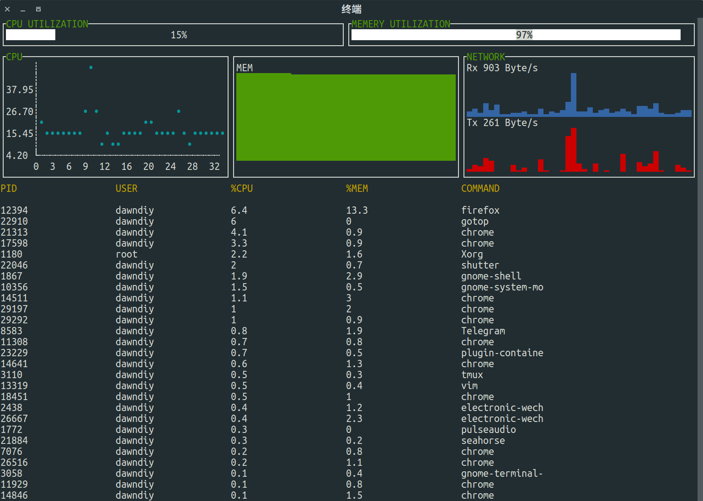

# gotop

[](https://github.com/dawndiy/gotop/releases/latest)
[](https://raw.githubusercontent.com/dawndiy/gotop/master/LICENSE)
[](https://uappexplorer.com/snap/ubuntu/gotop)

A top like command line tool with Terminal UI

## Install
```bash
sudo snap install gotop
```

## Screenshot


## License

Copyright (C) 2017  [DawnDIY](mailto:dawndiy.dev@gmail.com)

This program is free software: you can redistribute it and/or modify
it under the terms of the GNU General Public License as published by
the Free Software Foundation, either version 3 of the License, or
(at your option) any later version.

This program is distributed in the hope that it will be useful,
but WITHOUT ANY WARRANTY; without even the implied warranty of
MERCHANTABILITY or FITNESS FOR A PARTICULAR PURPOSE.  See the
GNU General Public License for more details.

You should have received a copy of the GNU General Public License
along with this program.  If not, see <http://www.gnu.org/licenses/>.
